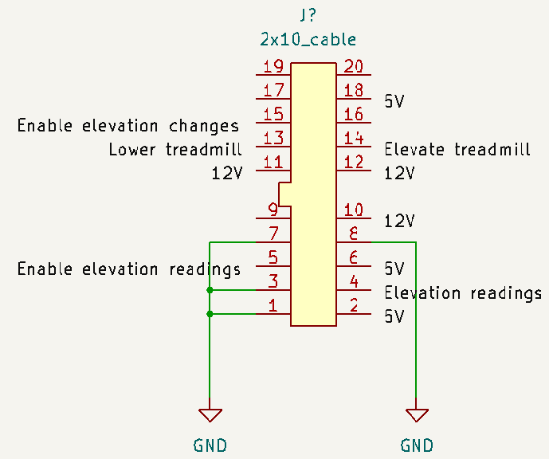

# The journey to a fancy smart treadmill

The goal of this project was to replace the front panel of the
[T9800 treadmill](https://www.toughtrain.com/vision-fitness/vision-fitness-treadmills/vision-t9800hrt-platform-treadmill) with a touchscreen.
I had some web developers to handle the UI, so my job was to interface with the treadmill's motor controller and make it available over a
network.

There was no technical documentation for the treadmill. The JTAG headers didn't work, nor did the
[CSAFE](https://en.wikipedia.org/wiki/Communications_Specification_for_Fitness_Equipment) port, so I was left with reverse-engineering the
signals between the top panel and the motor controller. I did find a engineering manual for repairmen though, which revealed the secret
engineering mode. That gave me direct control of the motors, which made deciphering the signals easier.

## Initial discovery

The first step was to disconnect the cable running from the front panel to the motor controller, and patch it through a breadboard. I used
the [Analog Discovery Studio](https://digilent.com/reference/test-and-measurement/analog-discovery-studio/start), so that I could take
advantage of its logic analyzer. But the first step was to grab the multimeter and find the power and ground lines. I found three 12V lines,
three 5V lines and four ground lines, leaving me with ten communication lines.

Next, I wired in the DIO pins of the Analog Discovery Studio and took some readings with the logic analyzer. Running through the motions,
I came to believe that elevation was the simplest part, so I started with that. I entered engineering mode, drilled down to the hardware
test, then changed the elevation. Here is what I read:

## Deciphering elevation

Clearly, pins 13 (T7) and 14 (B7) control the elevation motor. The hardware test pulls pin 15 (T8) high, and there's a clock running on pin
9 (T5). The other pins going high were a mystery. That was enough to get started. I branched the motor controller cable to a second location
on the breadboard, and added some dip switches to each location. Then I hooked a Raspberry Pi into the new location, because that would make
it easy to provide a REST API for the web devs. With the switches in place, I could switch between the Pi and the front panel without moving
wires around.

Experimentation and trial & error got me some results: Hold pin 15 high, then use pins 13 and 14 to change the elevation (see the [protocol doc](protocol.md)). Everything else turned out to be unnecessary.

Elevation readings proved a bit trickier though. Upon closer inspection with an oscilloscope, I discovered that pin 4 is an analog signal
representing the elevation. The Raspberry Pi doesn't have an ADC, so I switched to an Arduino. The problem with the Arduino is that it
generates 5V signals, while the front panel sends 3.3V signals. I grabbed some resistors and set up some voltage dividers to fix that. But
that presented a new problem: while the Arduino was now sending 3.3V signals in isolation, they dropped to 2V signals when connected to the
motor controller, which were interpreted as digital 0. Rather than finding yet another fix, I switched to an STM32 Nucleo board, which
generates 3.3V signals. That solved the problem and made my circuitry simpler.

With that out of the way, experimentation could continue. I was initially unable to read the elevation, but I eventually discovered that you
need to hold pin 5 high to make the sensor work. And that was all I needed to reach my first milestone: a working elevation demo. See git
tag: v0.1-elevation for the result.

